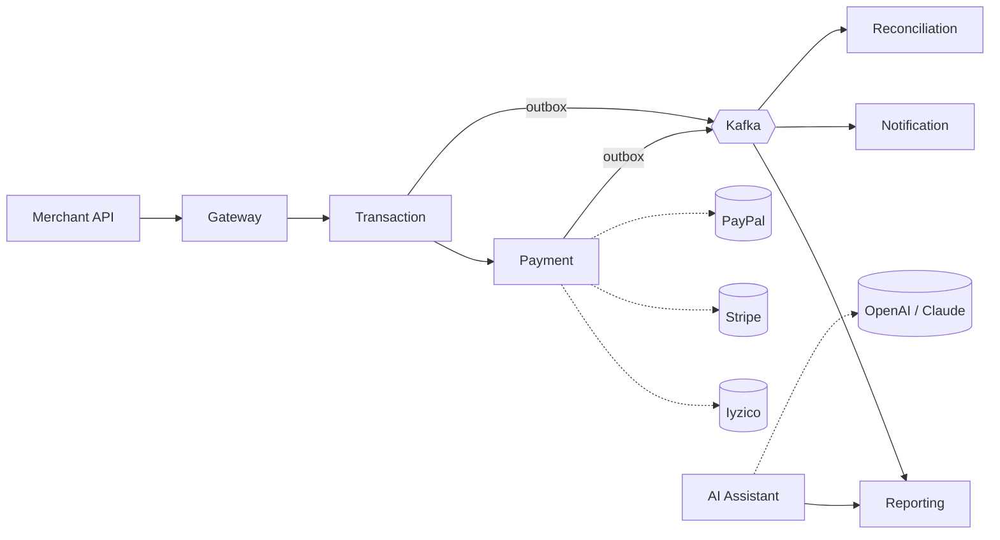

# PayFlow

A reference implementation of a multi-tenant payment orchestration platform, built in .NET 8 microservices. It unifies three payment providers behind a single API using Strategy + Adapter patterns, processes transactions through an event-driven pipeline with reliable Kafka publishing via the outbox pattern, and includes an AI assistant that answers merchant questions using RAG.

The audience for this repo is *engineers reading the code*. The docs describe the architectural decisions in the way you would defend them in a review, not the way a marketing page would describe them.

> **Status:** documentation-first. The code is being built incrementally; the docs commit was the first pass at thinking through the design. Expect doc drift as the code lands.

## What's planned

- **API Gateway** (YARP) — JWT validation, rate limiting, request routing.
- **Identity** — tenants, users, roles, API keys, JWT issuance.
- **Payment** — provider abstraction with Iyzico, Stripe, PayPal (mock) adapters.
- **Transaction** — transaction lifecycle, idempotency, the outbox, intelligent routing.
- **Reconciliation** — daily statement matching (Hangfire), the refund saga.
- **Notification** — Kafka-driven email/SMS dispatch, RabbitMQ retry queue.
- **Reporting** — CQRS read projections, dashboard endpoints.
- **AI Assistant** — RAG pipeline over pgvector, OpenAI + Anthropic behind a swap-friendly abstraction.

## The 30-second tour

A merchant calls `POST /api/transactions`. Gateway authenticates, forwards to the Transaction service. Transaction picks a provider per the tenant's routing rule and calls Payment. Payment's adapter speaks the provider's protocol. On commit, Transaction writes an outbox row in the same DB transaction; a publisher worker delivers it to Kafka. Reporting, Notification, and Reconciliation react asynchronously.

The longer version is in [docs/flows/payment-happy-path.md](docs/flows/payment-happy-path.md).

## Getting started

The local stack is `docker-compose`-based — see [docs/devops/local-stack.md](docs/devops/local-stack.md). The code is not there yet; the doc describes the intended setup.

## Where to look

### Start here

| If you want to understand... | Go to |
|---|---|
| The shared vocabulary | [Glossary](docs/domain/glossary.md) |
| The service shape | [Bounded contexts](docs/architecture/bounded-contexts.md) |
| Why the architecture is what it is | [ADRs](docs/adr/) |
| What's in the stack | [Tech selection](docs/architecture/tech-stack.md) |

### Architecture

- [C4 — Context diagram](docs/architecture/c4-context.md) and [Container diagram](docs/architecture/c4-container.md)
- [Bounded contexts](docs/architecture/bounded-contexts.md)

### How the signature flows work

- [Payment happy path](docs/flows/payment-happy-path.md)
- [Refund saga](docs/flows/refund-saga.md)

### Data

- [Transaction ERD](docs/database/erd-transaction.md) — the central context's schema
- [Multi-tenancy isolation](docs/database/multi-tenancy-isolation.md)
- [Outbox schema](docs/database/outbox.md)

### Events

- [Event catalog](docs/events/catalog.md)
- [Transaction state machine](docs/state-machines/transaction.md)

### API contracts

- [Error codes](docs/api/errors.md)
- [Idempotency guide](docs/api/idempotency.md)
- [Webhook spec](docs/api/webhooks.md)

### Security

- [Threat model](docs/security/threat-model.md)

### AI

- [RAG architecture](docs/ai/rag-architecture.md)

### Onboarding

- [Coding standards](docs/onboarding/coding-standards.md)
- [Local stack](docs/devops/local-stack.md)

## What this project is — and isn't

It **is** a reference implementation of patterns commonly required in payment platforms: provider abstraction, intelligent routing, outbox-backed eventing, CQRS for read scale, multi-tenancy, RAG with tenant-scoped knowledge.

It **isn't** a PCI-DSS-certified payment processor, a chargeback handling system, a production-ready substitute for real Iyzico / Stripe / PayPal integrations, or a multi-region HA deployment.

## A note on docs

The first pass of docs is broader than the code — designs were written down before the implementation caught up. As the code lands, docs are tightened or removed; what stays here is what stays referenced from the code.

## License

[MIT](LICENSE) © 2026 batinmustu
