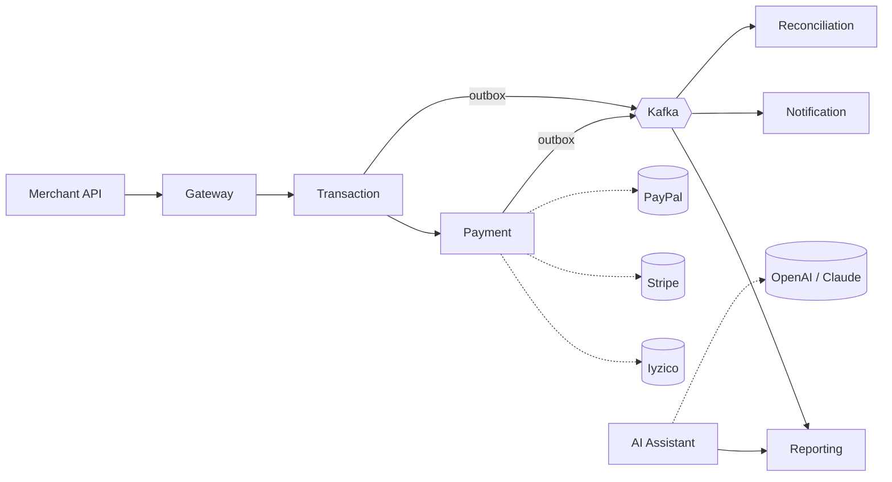

# PayFlow

A reference implementation of a multi-tenant payment orchestration platform, built in .NET 8 microservices. It unifies three payment providers behind a single API using Strategy + Adapter patterns, processes transactions through an event-driven pipeline with reliable Kafka publishing via the outbox pattern, and includes an AI assistant that answers merchant questions using RAG.

The audience for this repo is *engineers reading the code*. The docs describe the architectural decisions in the way you would defend them in a review, not the way a marketing page would describe them.

## Status

| Milestone                                                  | State |
|------------------------------------------------------------|-------|
| M0 Foundation (sln, infra, observability)                  | ✅    |
| M1 Identity & Gateway                                      | ✅    |
| M2 Payment (provider Strategy + Adapter)                   | ✅    |
| M3 Transaction + Eventing (outbox + Kafka)                 | ✅    |
| M4 Reconciliation + refund saga                            | ✅    |
| M5 Reporting (CQRS read-side projections)                  | ✅    |
| M6 Notification (Kafka-driven email log)                   | ✅    |
| M8 Observability (Kafka trace propagation + log enrichers) | partial — diagrams + dashboards landing |
| M9 Deployment (prod compose + CI)                          | pending |
| M7 AI Assistant (RAG over pgvector)                        | pending (sequenced last) |

Six services online (Identity, Payment, Transaction, Reconciliation, Reporting, Notification) behind a YARP gateway. 183 unit + integration tests green. End-to-end traces span every service in one Jaeger view — Kafka is no longer a trace boundary.

## The 30-second tour



A merchant calls `POST /api/transactions`. Gateway authenticates, forwards to the Transaction service. Transaction picks a provider per the tenant's routing rule and calls Payment. Payment's adapter speaks the provider's protocol. On commit, Transaction writes an outbox row in the same DB transaction; a publisher worker delivers it to Kafka. Reporting, Notification, and Reconciliation react asynchronously.

The full runtime topology (ports, schemas, telemetry sinks) is in [docs/diagrams/runtime-topology.md](docs/diagrams/runtime-topology.md); the [end-to-end trace walkthrough](docs/diagrams/end-to-end-trace.md) follows one refund's spans through every service; the [payment happy path](docs/flows/payment-happy-path.md) is the request-level narrative.

## Getting started

```sh
# 1. Bring up infrastructure (Postgres, Kafka, Redis, RabbitMQ, Jaeger, Seq)
docker compose -f deploy/docker-compose.infra.yml up -d

# 2. Build the solution
dotnet build PayFlow.sln

# 3. Run each service in its own shell (or background as you prefer)
dotnet run --project src/Services/Identity/PayFlow.Identity.API           --urls=http://127.0.0.1:5001
dotnet run --project src/Services/Payment/PayFlow.Payment.API             --urls=http://127.0.0.1:5002
dotnet run --project src/Services/Transaction/PayFlow.Transaction.API     --urls=http://127.0.0.1:5003
dotnet run --project src/Services/Reconciliation/PayFlow.Reconciliation.API --urls=http://127.0.0.1:5004
dotnet run --project src/Services/Reporting/PayFlow.Reporting.API         --urls=http://127.0.0.1:5005
dotnet run --project src/Services/Notification/PayFlow.Notification.API   --urls=http://127.0.0.1:5006
dotnet run --project src/ApiGateway/PayFlow.Gateway                       --urls=http://127.0.0.1:5050
```

Each service applies its EF Core migrations on startup in Development. The Postman collection at `planning/PayFlow.postman_collection.json` exercises every endpoint; replay the requests in the order shown in the folders. Full local-stack notes (ports, healthcheck commands, observability sinks) live in [docs/devops/local-stack.md](docs/devops/local-stack.md).

Useful local URLs once everything is up: **Jaeger** at `http://localhost:16686`, **Seq** at `http://localhost:5341`, **RabbitMQ management** at `http://localhost:15672` (guest / guest).

## Where to look

### Start here

| If you want to understand... | Go to |
|---|---|
| The shared vocabulary | [Glossary](docs/domain/glossary.md) |
| The service shape | [Bounded contexts](docs/architecture/bounded-contexts.md) |
| Why the architecture is what it is | [ADRs](docs/adr/) |
| What's in the stack | [Tech selection](docs/architecture/tech-stack.md) |

### Architecture

- [C4 — Context diagram](docs/architecture/c4-context.md) and [Container diagram](docs/architecture/c4-container.md)
- [Bounded contexts](docs/architecture/bounded-contexts.md)
- [Runtime topology](docs/diagrams/runtime-topology.md) — actual processes, ports, and wire-traffic arrows on the local stack
- [End-to-end trace walkthrough](docs/diagrams/end-to-end-trace.md) — one refund's spans across all services

### How the signature flows work

- [Payment happy path](docs/flows/payment-happy-path.md)
- [Refund saga](docs/flows/refund-saga.md)

### Data

- [Transaction ERD](docs/database/erd-transaction.md) — the central context's schema
- [Multi-tenancy isolation](docs/database/multi-tenancy-isolation.md)
- [Outbox schema](docs/database/outbox.md)

### Events

- [Event catalog](docs/events/catalog.md)
- [Transaction state machine](docs/state-machines/transaction.md)

### API contracts

- [Error codes](docs/api/errors.md)
- [Idempotency guide](docs/api/idempotency.md)
- [Webhook spec](docs/api/webhooks.md)

### Security

- [Threat model](docs/security/threat-model.md)

### AI

- [RAG architecture](docs/ai/rag-architecture.md)

### Onboarding

- [Coding standards](docs/onboarding/coding-standards.md)
- [Local stack](docs/devops/local-stack.md)

## What this project is — and isn't

It **is** a reference implementation of patterns commonly required in payment platforms: provider abstraction, intelligent routing, outbox-backed eventing, CQRS for read scale, multi-tenancy, RAG with tenant-scoped knowledge.

It **isn't** a PCI-DSS-certified payment processor, a chargeback handling system, a production-ready substitute for real Iyzico / Stripe / PayPal integrations, or a multi-region HA deployment.

## A note on docs

The first pass of docs is broader than the code — designs were written down before the implementation caught up. As the code lands, docs are tightened or removed; what stays here is what stays referenced from the code.

## License

[MIT](LICENSE) © 2026 batinmustu
