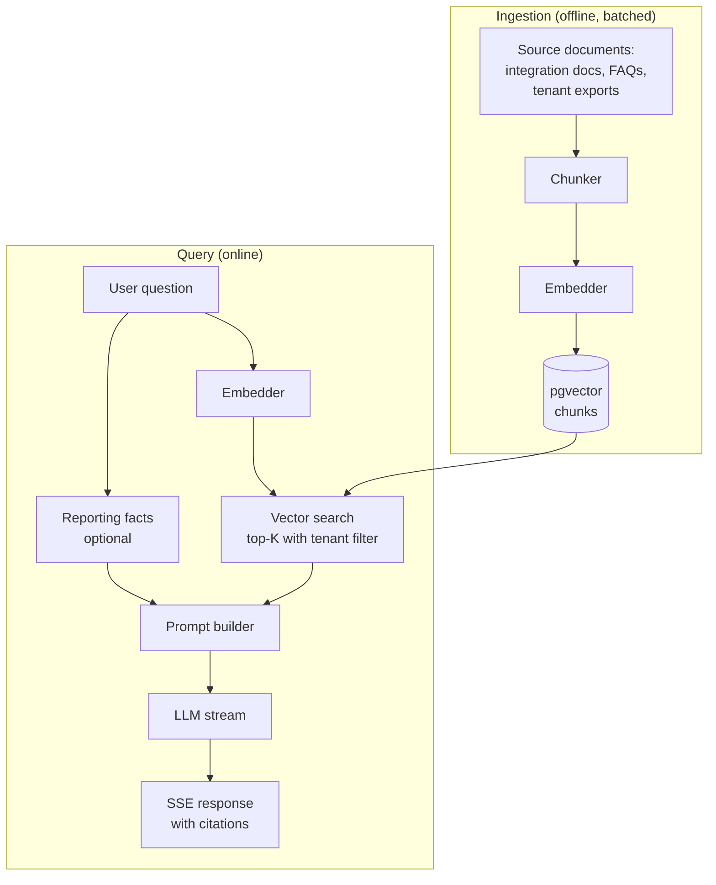

# RAG Architecture

> **Status: design doc — M7, not yet implemented.** The AI Assistant service is the last milestone on the roadmap. The document below is the shape we want to ship, written before the code, and is the contract a reviewer can hold the implementation to once it lands. Hangfire / specific schedules / pgvector index choices in here are the target, not the current state.

The AI Assistant's retrieval-augmented generation pipeline, end to end. Two pipelines really: ingestion (background, batched) and query (online, latency-sensitive). They share the vector store but nothing else.

This doc covers both pipelines end-to-end — the offline ingestion side and the online query side.



## Ingestion pipeline

### Source set

Two kinds of documents:

- **Global knowledge base.** Provider integration docs (Iyzico, Stripe, PayPal), the PayFlow API docs themselves, common FAQs. Indexed with `tenant_id = null`. Every tenant retrieves from this set.
- **Tenant-scoped.** A tenant can opt in to having a snapshot of their transaction summary (per provider, per day, last 90 days) ingested as a document. Indexed with their `tenant_id`. Used only for their own assistant conversations.

We do *not* ingest individual transaction rows. The reasons: (a) cardinality would dominate the index, (b) PII risk, (c) the questions tenants ask are almost always about aggregates, not individual rows, and aggregates are better served by direct queries to Reporting (which the assistant can call as a read-only consumer).

### Chunking

Each document is split into chunks targeting ~500 tokens with 50 tokens of overlap between adjacent chunks. The exact split point is at sentence boundaries; we prefer slightly variable chunk size over breaking sentences.

For markdown documents (most of our global KB), the splitter respects heading boundaries — a chunk does not span a `##` boundary unless a single section is genuinely larger than the target. This keeps retrieved chunks coherent.

Each chunk carries metadata: the document id, the chunk index, the heading hierarchy ("Section A → Subsection 2"), and the page number if applicable. This metadata appears alongside the chunk text in the prompt, so the model can cite by section rather than by opaque id.

### Embedding

OpenAI's `text-embedding-3-small` (1536 dimensions). Used regardless of which LLM completion provider is configured per tenant ([ADR-0005](../adr/0005-llm-provider-abstraction.md)). Two reasons:

1. Mixing embedding spaces between providers would require parallel indexes, which is operationally expensive for marginal gain.
2. The retrieval step is decoupled from the generation step; we can swap completion providers without re-embedding.

Embeddings are normalised to unit length before storage. This lets us use inner-product similarity (`<#>` in pgvector) which is faster than cosine on normalised vectors.

### Ingestion runs

Triggered:

- **On change** for the global KB: a CI job re-runs ingestion when a document under `docs/` (or wherever the KB lives) is edited. Granular: only changed documents are re-embedded.
- **Daily** for tenant exports: a Hangfire job at 03:00 Europe/Istanbul re-ingests the previous day's snapshot per tenant that opted in.

Re-ingesting a document doesn't delete the old chunks immediately. Instead the old document row gets `superseded_at = now()` and the new document row + chunks are inserted fresh. Citations from past conversations still resolve. A cleanup job hard-deletes superseded chunks after 30 days.

### Why we re-embed rather than incremental update

A change to a document might shift the chunk boundaries (heading restructured, paragraph deleted). Trying to keep stable chunk ids across edits is more complex than re-embedding from scratch. For our document scale (hundreds, not millions), the cost is small.

## Query pipeline

### Authentication and tenant resolution

The chat endpoint is `POST /api/assistant/conversations/{id}/messages`, exposed through the gateway like any other PayFlow API. The auth path is identical to the rest of the system:

- The gateway validates the JWT against Identity's JWKS, terminates the merchant-facing connection, and forwards to the AI Assistant service with an internal JWT carrying `tid`, `sub`, and roles.
- The Assistant's request pipeline reads `tid` into `ITenantContext` before any handler runs (see [multi-tenancy-isolation.md](../database/multi-tenancy-isolation.md)). The vector search's `tenant_id = $2` parameter and the conversation's `TenantId` both come from this context.
- API-key authentication is not enabled on the chat endpoint. The assistant is for dashboard users, not server-to-server integrations.

Rate limiting is enforced at the gateway with two budgets: a low per-user per-minute limit (the user opens a chat and types) and a higher per-tenant per-day limit (token-cost guardrail). Exceeded budgets return `429 RATE_LIMITED` with `Retry-After`.

SSE specifics: the gateway is configured to not buffer responses for this route (`X-Accel-Buffering: no`, no proxy_buffering), and the per-request timeout is raised to 5 minutes to allow long completions. JWT expiry mid-stream does not abort the response in progress; subsequent requests will fail and the client must refresh.

### Embedding the question

Same model, same normalisation. Cached per (tenant, query string) for 10 minutes to handle the case of a user repeating a question.

### Vector search

```sql
SELECT id, document_id, content, metadata,
       (embedding <#> $1) * -1 AS score    -- inverted because <#> is negative inner product
FROM chunks
WHERE tenant_id IS NULL OR tenant_id = $2
ORDER BY embedding <#> $1
LIMIT 8;
```

- `<#>` is pgvector's negative inner product operator (fastest for normalised vectors).
- `tenant_id IS NULL OR tenant_id = $2` is the tenant isolation filter: global KB plus this tenant's own scoped chunks.
- `LIMIT 8` is the top-K. Configurable per tenant; default 8.

The HNSW index parameters (`m=16, ef_construction=64`) were chosen with no strong reason beyond "they are sensible defaults for our scale". Re-tuning is an open task; we have not yet hit recall problems that justify exploration.

### Score thresholding

A chunk with similarity score below 0.7 (cosine equivalent) is dropped before prompt assembly. The remaining chunks (which may be fewer than top-K) are passed through.

If after thresholding there are zero chunks, the prompt template explicitly says "no relevant context was retrieved" and instructs the model to answer from general knowledge or to admit it does not know. This is the closest thing to a hallucination guard we have; the model is more conservative when it is told it has no support.

### Fact retrieval (optional side path)

For questions that imply aggregate facts about the tenant ("how many failed payments this week", "what was Iyzico's success rate yesterday"), a classifier (a small set of regex + keyword rules at the moment) routes a Reporting query alongside the vector search. The retrieved facts go into the prompt as a structured "facts you may use" block, distinct from the retrieved chunks.

Why a classifier and not "let the LLM figure it out"? We considered it. The reliability of "ask the model to call a tool" was, at the time of design, lower than the reliability of "always retrieve, the model decides what to use". The classifier is an artefact of that decision — when the LLM landscape changes, we revisit.

### Prompt assembly

The prompt is built from a fixed template:

```
SYSTEM:
  You are the PayFlow assistant. Constraints:
  - You answer only from provided context. If context does not cover the question, say so.
  - You cite chunks by [N] markers.
  - You never offer to perform actions.

RETRIEVED CONTEXT:
  [1] {chunk text, with heading metadata}
  [2] ...

FACTS (this tenant):
  - last_7_days_iyzico_success_rate: 0.945
  - ...

CONVERSATION:
  user: ...
  assistant: ...
  user: <new question>
```

The token budget is divided: ~30% for retrieved context, ~10% for facts, ~10% for conversation history, the rest reserved for the response.

### Streaming

The response streams as SSE. The HTTP response begins emitting bytes before the LLM is finished — typical time to first token is under 1 second with OpenAI, slightly higher with Anthropic.

Each chunk from the LLM arrives as `CompletionChunk` (text delta plus optional usage / finish reason on the last one), is re-encoded as an SSE event, and written to the response. On the client side, the dashboard renders incrementally with a typing-cursor animation.

### Citation rendering

The model produces `[1]`, `[2]` markers inline. The assistant records the mapping `chunk_id → citation_id` and stores it on the message. The dashboard renders the markers as clickable badges that open the corresponding source document at the right heading.

## Why this design and not something else

A few choices that have alternatives:

### pgvector vs a dedicated vector DB

pgvector is good enough for our scale (tens of thousands of chunks, mostly read-heavy) and lets us keep the operational surface small. A dedicated vector DB (Pinecone, Qdrant, Weaviate) would give us better indexes for higher cardinalities and richer filter expressions, but it would also be a new system to operate. We will revisit if the chunk count grows past a few million.

### Local embedding models

Considered. We use OpenAI's embedding model because (a) ingestion is offline so latency is irrelevant, and (b) the hosted model is consistent enough across versions that we do not have to manage drift. A local model (BGE, E5) would remove the OpenAI dependency for ingestion but add an operations burden.

### Reranking

We do not rerank retrieved chunks with a second model. With our chunk count and the top-K of 8, the marginal benefit of reranking is small. The token budget saved goes to the response. If we expand to a larger KB, reranking is the first thing to revisit.

### Tool use / function calling

The assistant is **deliberately read-only**. The only "function" it could call is to fetch more context, and the retrieval already does that. We do not give the model the ability to refund, adjust routing rules, or anything else with side effects. If a user asks "refund this for me", the model answers with the steps to do it manually.

This is a hard architectural rule from [bounded-contexts.md](../architecture/bounded-contexts.md). The day someone proposes tool-use, they propose it through an ADR.

## What this doc does not cover

- **Evaluation methodology.** We do not have an evaluation set for this project. A real implementation would; sketch: golden questions with ideal answers, faithfulness scored by a separate model, regression detection per release.
- **Cost management.** Per-token billing is real but at this project's scale it is not an operational issue. We surface token usage as a metric so the cost is at least observable.
- **Multi-language support.** Currently English only. Turkish would be a natural addition; the embedding model handles it reasonably.

## Where things may break

The places we would not be surprised to see issues:

- **Chunk boundaries on edge-case documents.** Tables, code blocks, deeply-nested headings. The chunker is heuristic; it does not produce perfect splits on everything.
- **Score threshold too aggressive.** A 0.7 default may drop chunks that are weakly relevant but still useful. Tuning happens by looking at conversations where the assistant said "I don't know" and seeing whether retrieval should have surfaced something.
- **Stale tenant snapshots.** A tenant whose data changed since last night's ingestion gets answers based on yesterday's snapshot. The dashboard makes the "as of X" timestamp visible on the assistant.
