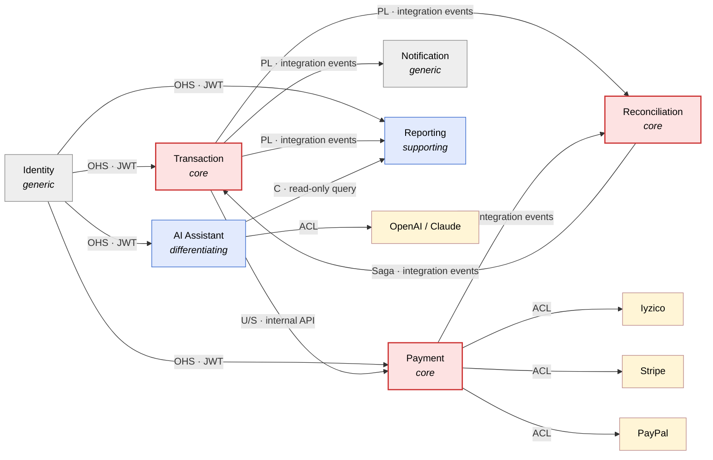

# Bounded Contexts & Context Map

This document defines the boundaries between PayFlow's services from a domain perspective, not a deployment one. Two services may share a Postgres instance and a Kubernetes namespace; what makes them separate *contexts* is that each one has its own model of the world and its own language. Code that crosses a boundary must do explicit translation.

The terms used here (Customer/Supplier, Conformist, Anti-Corruption Layer, Shared Kernel, Open Host Service, Published Language) are the standard set from Evans' *Domain-Driven Design*. They are deliberately not redefined inline — if a term is unfamiliar, the [glossary](../domain/glossary.md) covers the project-specific ones and the rest are one search away.

---

## The contexts

| Context | Classification | Owns | Explicitly does *not* own |
|---|---|---|---|
| **Identity** | Generic supporting | Tenants, tenant users, roles, API keys, JWT issuance | Anything business-domain. Permissions are coarse-grained ("can refund", not "can refund up to 5000 TRY"). |
| **Payment** | Core | Provider adapters, per-provider attempts, provider credentials | Whether a charge "should" happen. Just answers "did this provider accept this card right now?" |
| **Transaction** | Core | Transaction lifecycle, idempotency, routing rules, outbox | The provider protocol details. Talks to Payment via integration events and a thin internal API. |
| **Reconciliation** | Core | Daily statements, reconciliation runs, mismatches, refund saga coordination | Real-time transaction creation. It is strictly a downstream observer + scheduled job runner. |
| **Notification** | Generic supporting | Templates, delivery attempts, channel-specific routing (email/SMS) | The event payloads themselves. Treats them as opaque sources of template variables. |
| **Reporting** | Supporting | Read-side projections, dashboard query endpoints | Authoritative state. Always derived from the eventing layer. Always eventually consistent. |
| **AI Assistant** | Differentiating | Conversations, embeddings, RAG pipeline | Any business decision. Read-only with respect to the rest of the system. |

The "classification" column matters: it tells reviewers where complexity is allowed. Custom code in the **Transaction** context (core) gets careful design review; a clever abstraction in **Notification** (generic supporting) is a smell — that context should look boring.

---

## Context map

Legend:

- **OHS** — Open Host Service. The upstream context exposes a stable, documented contract that any downstream may depend on.
- **PL** — Published Language. The contract itself: in our case the integration event schemas in `PayFlow.Contracts`.
- **ACL** — Anti-Corruption Layer. The downstream context translates external models into its own and never lets the external model leak through.
- **U/S** — Upstream/Supplier and downstream/Customer. The supplier sets the contract; the customer adapts to it.
- **C** — Conformist. Like U/S, but the downstream accepts whatever the upstream produces without asking for changes.
- **Saga** — Bidirectional event exchange that implements a multi-step workflow.

---

## Relationships in detail

### Identity → everyone else (Open Host Service)

Identity issues JWTs and publishes the claims that other services trust. The contract is the token format itself: required claims (`sub`, `tid` for tenant, `roles`), refresh semantics, key rotation policy. Every other service is downstream.

This is an OHS rather than a Shared Kernel because the consumers don't link Identity's code — they validate the token using the public key alone. That keeps Identity free to refactor internally without coordinating releases.

### Transaction → Payment (Customer/Supplier with internal API)

Transaction is the supplier here in the *protocol* sense: it tells Payment "execute this charge against this provider, here are the details". But Payment is the upstream in *knowledge*: it knows the provider quirks, and Transaction trusts its return value.

In practice this is an internal HTTP call (gRPC was considered and rejected in ADR-0003's discussion). The contract is small and Payment-owned: a `PaymentResult` value object with a normalised status + the original provider response stored as opaque JSON for forensics.

The thing that *does not* happen here: Transaction does not subscribe to Payment's domain events. Payment publishes integration events for read-side consumers (Reconciliation, Reporting), but Transaction works synchronously because it needs the result to decide whether to fail over to the next provider.

### Transaction → Reporting / Notification / Reconciliation (Published Language)

The three downstream consumers of Transaction events are conformists in spirit, but the contract is intentionally a Published Language: versioned schemas in `PayFlow.Contracts`, owned by Transaction, evolved with backwards compatibility rules. The schema list and the versioning rules are in [docs/events/catalog.md](../events/catalog.md).

If a consumer wants a new field, the negotiation is: add it as optional, ship the producer first, ship the consumer second. We do not branch the schema per consumer.

### Payment → External providers (Anti-Corruption Layer)

Each provider adapter is a textbook ACL. The external API is messy, inconsistent across providers, and not under our control. Inside the adapter we translate to our internal `PaymentRequest` / `PaymentResult` model and never expose Iyzico/Stripe/PayPal-specific types past the adapter boundary.

This is the reason Payment exists as its own context rather than living inside Transaction: if a provider's response model leaks into the Transaction aggregate, every new provider becomes a Transaction-context change. The ACL pushes that pain into Payment, where it belongs.

### Reconciliation → Transaction (Saga choreography)

The refund flow is the one place a downstream context drives a change back into Transaction. It runs over integration events end-to-end — no synchronous cross-service call from Reconciliation back into Transaction:

1. Merchant requests a refund (Transaction publishes `RefundRequested`).
2. Reconciliation picks it up, publishes `RefundProcessing`. Transaction consumes it and moves the refund record to `Processing`.
3. Reconciliation calls Payment for the provider-side refund.
4. On success, Reconciliation publishes `RefundCompleted`. Transaction consumes it and moves to `PartiallyRefunded` or `Refunded`.
5. On failure, `RefundFailed`. Transaction stays in `Captured` and records the failure reason.

No shared transaction, no orchestrator, no API call back into Transaction from a downstream context. Each step is idempotent. The full flow is in [docs/flows/refund-saga.md](../flows/refund-saga.md).

### AI Assistant → Reporting (Conformist, read-only)

The assistant needs aggregate-level facts to answer tenant questions ("how many failed payments did I have last week?"). It reads from Reporting's projections, treats them as truth, and never writes back. If Reporting changes a column, the assistant adapts. This is the cheapest relationship in the system and we want to keep it that way.

### AI Assistant → LLM provider (Anti-Corruption Layer)

OpenAI and Claude have different request shapes, streaming protocols, and token-counting rules. The `ILlmProvider` abstraction is the ACL. Cost, retry, and prompt-template concerns live above the abstraction; provider-specific quirks live below it. See [ADR-0005](../adr/0005-llm-provider-abstraction.md).

---

## Shared kernels

There are exactly two shared kernels, both deliberately small:

**`PayFlow.SharedKernel`** — the `Result<T>` type, `BaseEntity`, `DomainEvent` base class, `Money` value object, a few error-code primitives. Anything in here is a change that requires touching every service, so the bar for additions is high.

**`PayFlow.Contracts`** — the integration event schemas. Owned by the producing service but linked by consumers. We accept that this couples consumers to producers at the compilation step in exchange for compile-time guarantees about message shape. The trade is documented in ADR-0003.

A common mistake when starting a microservices codebase is to grow a shared "Common" library that ends up holding half the domain. We will reject PRs that add domain types here — they belong inside a service.

---

## What this map deliberately leaves out

- **Observability** (Serilog, OpenTelemetry, Jaeger) is not a context. It's infrastructure code wired up identically in every service. Treating it as a context would imply it has a domain language to negotiate, and it doesn't.
- **API Gateway** is a deployment artefact, not a context. It owns no business state, no aggregates, no events. It validates JWTs and forwards.
- **Outbox** is also not a context — it's a pattern implemented as a library and reused. The Transaction service is the *only* current producer that needs it; if Payment grows event-publishing needs in the future, it will use the same library.

If something looks like it might be a new context, the test is: does it have a model and a language that doesn't fit any existing one? If yes, name it and add it here. If no, it's a feature of an existing context.
