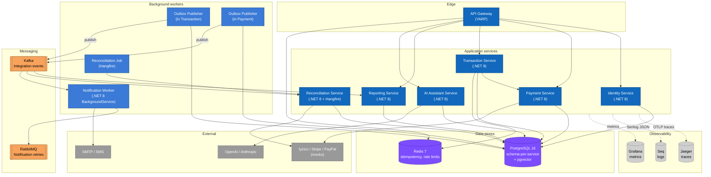

# C4 — Container Diagram (Level 2)

Zooming one level into the PayFlow box from [c4-context.md](c4-context.md). Each "container" here is a separately deployable unit: an ASP.NET Core service, a worker process, a database, or a broker. Within each container, the internal structure (Domain / Application / Infrastructure / API) is the same Clean Architecture layout — that's covered in [docs/onboarding/coding-standards.md](../onboarding/coding-standards.md).

## Containers

| Container | Tech | Responsibility |
|---|---|---|
| **API Gateway** | YARP on .NET 8 | Single ingress. Validates JWTs against Identity's public keys (no callback per request), enforces rate limits via Redis, forwards to the matching service. |
| **Identity Service** | ASP.NET Core | Issues JWTs, manages tenants/users/roles and API keys. Owns its schema in Postgres. |
| **Payment Service** | ASP.NET Core | Wraps the three provider adapters behind a common `IPaymentProvider` interface. Stores provider credentials encrypted at rest. Synchronous to its callers; publishes `payment.completed.v1` to downstream observers through its own outbox. |
| **Transaction Service** | ASP.NET Core | The aggregate of record for a payment attempt. Holds the state machine, the outbox, idempotency keys, the routing engine. Calls Payment synchronously. |
| **Reconciliation Service** | ASP.NET Core + Hangfire | Hangfire scheduler hosting daily statement-fetch jobs. Also the refund saga coordinator. |
| **Reporting Service** | ASP.NET Core | CQRS read side. Consumes integration events, maintains projections in its own schema, serves dashboard queries. |
| **AI Assistant Service** | ASP.NET Core | RAG pipeline. Owns the embeddings schema (pgvector). Streams responses over SSE. |
| **Notification Worker** | .NET 8 BackgroundService | Consumes Kafka integration events, renders templates, sends through SMTP/SMS, retries via RabbitMQ. |
| **Outbox Publisher** | In-process worker, one per producing service (currently Transaction and Payment) | Polls the local outbox table, publishes to Kafka, marks rows published. See [docs/database/outbox.md](../database/outbox.md). |

## Data stores

**PostgreSQL** is one physical instance in dev, separated per-service in prod. Each service owns one schema and uses its own DB user; no cross-schema queries. The AI Assistant schema also hosts the pgvector extension.

**Redis** is single-instance, used narrowly: idempotency-key storage (with TTL) and gateway rate-limit counters. Nothing in Redis is the source of truth for anything.

## Messaging

**Kafka** carries every cross-service integration event. Topics are partitioned by `TenantId` so a tenant's events stay ordered. The catalogue is in [docs/events/catalog.md](../events/catalog.md).

**RabbitMQ** carries notification retries with priorities and TTL. Notification is the only producer and consumer. The reason both brokers exist is documented in ADR-0003.

## Observability sinks

Application services emit OTLP traces to Jaeger, structured logs to Seq, and metrics scraped by a Prometheus-compatible Grafana setup. Configuration lives in `PayFlow.Observability` and is wired identically per service.

## What this diagram does not yet show

- Replicas / horizontal scaling — every service is stateless and runs N replicas; that is a deployment-time concern.
- The internal Clean Architecture split of each service — that's a Level 3 diagram and we only produce it for two services where the structure is non-trivial (Transaction and Payment); see `docs/diagrams/c4-component-*.puml` (planned).
- Helm/K8s manifests — see [docs/devops/](../devops/).
