# C4 — Container Diagram (Level 2)

Zooming one level into the PayFlow box from [c4-context.md](c4-context.md). Each "container" here is a separately deployable unit: an ASP.NET Core service, a worker process, a database, or a broker. Within each container, the internal structure (Domain / Application / Infrastructure / API) is the same Clean Architecture layout — that's covered in [docs/onboarding/coding-standards.md](../onboarding/coding-standards.md).

```mermaid
flowchart TB
    classDef svc fill:#1168bd,stroke:#0b4884,color:#fff
    classDef worker fill:#3b7ad6,stroke:#0b4884,color:#fff
    classDef db fill:#7c4dff,stroke:#4b27a8,color:#fff
    classDef broker fill:#f7a35c,stroke:#a06f3a,color:#000
    classDef external fill:#999,stroke:#666,color:#fff
    classDef obs fill:#cfcfcf,stroke:#888,color:#000

    subgraph Edge["Edge"]
        GW["API Gateway<br/>(YARP)"]:::svc
    end

    subgraph Services["Application services"]
        IDENT["Identity Service<br/>(.NET 8)"]:::svc
        PAY["Payment Service<br/>(.NET 8)"]:::svc
        TX["Transaction Service<br/>(.NET 8)"]:::svc
        REC["Reconciliation Service<br/>(.NET 8)"]:::svc
        REPORT["Reporting Service<br/>(.NET 8)"]:::svc
        NOTIF["Notification Service<br/>(.NET 8)"]:::svc
        WH["Webhooks Service<br/>(.NET 8)"]:::svc
        AI["AI Assistant Service<br/>(.NET 8, planned M7)"]:::svc
    end

    subgraph Workers["In-process background workers"]
        OUTBOX_TX["Outbox Publisher<br/>(in Transaction)"]:::worker
        OUTBOX_PAY["Outbox Publisher<br/>(in Payment)"]:::worker
        OUTBOX_REC["Outbox Publisher<br/>(in Reconciliation)"]:::worker
        REC_RECOVERY["Refund saga recovery<br/>(in Reconciliation)"]:::worker
        NOTIF_RETRY["Notification retry consumer<br/>(in Notification, AMQP)"]:::worker
        WH_RETRY["Webhook retry sweeper<br/>(in Webhooks)"]:::worker
    end

    subgraph Data["Data stores"]
        PG[("PostgreSQL 16<br/>schema-per-service<br/>+ pgvector")]:::db
        REDIS[("Redis 7<br/>idempotency, rate limits")]:::db
    end

    subgraph Brokers["Messaging"]
        KAFKA[["Kafka<br/>Integration events"]]:::broker
        RMQ[["RabbitMQ<br/>Notification retries + DLQ"]]:::broker
    end

    subgraph Obs["Observability"]
        OTEL[("OTel Collector<br/>OTLP fan-out")]:::obs
        JAEGER[("Jaeger<br/>traces")]:::obs
        PROM[("Prometheus<br/>metrics store")]:::obs
        GRAFANA[("Grafana<br/>dashboards")]:::obs
        SEQ[("Seq<br/>logs")]:::obs
    end

    subgraph External["External"]
        PROV["Iyzico / Stripe / PayPal<br/>(mocks)"]:::external
        LLM["OpenAI / Anthropic"]:::external
        SMTP["SMTP / SMS"]:::external
        MERCH["Merchant backends<br/>(webhook receivers)"]:::external
    end

    GW --> IDENT
    GW --> PAY
    GW --> TX
    GW --> REPORT
    GW --> NOTIF
    GW --> WH
    GW --> AI
    GW --> REDIS

    TX --> PAY
    TX --> PG
    TX --> REDIS

    PAY --> PG
    PAY --> PROV

    IDENT --> PG

    REC --> PG
    REC --> PROV
    REC_RECOVERY --> REC

    REPORT --> PG
    NOTIF --> PG
    WH --> PG

    AI --> PG
    AI --> LLM

    OUTBOX_TX --> PG
    OUTBOX_TX -- "publish" --> KAFKA
    OUTBOX_PAY --> PG
    OUTBOX_PAY -- "publish" --> KAFKA
    OUTBOX_REC --> PG
    OUTBOX_REC -- "publish" --> KAFKA

    KAFKA --> REPORT
    KAFKA --> REC
    KAFKA --> NOTIF
    KAFKA --> WH

    NOTIF -- "publish failed sends" --> RMQ
    RMQ -- "delayed redelivery via DLX" --> NOTIF_RETRY
    NOTIF --> SMTP

    WH -- "HMAC-signed POST" --> MERCH
    WH_RETRY --> WH

    Services -. "OTLP" .-> OTEL
    OTEL -. "traces" .-> JAEGER
    OTEL -. "metrics scrape" .-> PROM
    PROM -. "datasource" .-> GRAFANA
    Services -. "Serilog JSON" .-> SEQ
```

## Containers

| Container | Tech | Responsibility |
|---|---|---|
| **API Gateway** | YARP on .NET 8 | Single ingress. Validates JWTs against Identity's public keys (no callback per request), enforces rate limits via Redis, forwards to the matching service. |
| **Identity Service** | ASP.NET Core | Issues JWTs, manages tenants/users/roles and API keys. Owns its schema in Postgres. |
| **Payment Service** | ASP.NET Core | Wraps the three provider adapters behind a common `IPaymentProvider` interface. Stores provider credentials encrypted at rest. Synchronous to its callers; publishes `payment.completed.v1` to downstream observers through its own outbox. |
| **Transaction Service** | ASP.NET Core | The aggregate of record for a payment attempt. Holds the state machine, the outbox, idempotency keys, the routing engine. Calls Payment synchronously. |
| **Reconciliation Service** | ASP.NET Core | Refund saga coordinator. Consumes `RefundRequested`, drives the Payment-side refund, publishes the terminal events. Hosts a recovery sweeper that re-attempts sagas stuck in `ProviderCalled`. |
| **Reporting Service** | ASP.NET Core | CQRS read side. Consumes integration events, maintains projections in its own schema, serves dashboard queries. |
| **Notification Service** | ASP.NET Core | Consumes Kafka events, renders templates, sends via SMTP/SMS (or logs in dev). Failed sends go to a RabbitMQ wait-queue + DLX + work-queue with five exponential-backoff attempts before terminal Failed + DLQ. |
| **Webhooks Service** | ASP.NET Core | 8th microservice. Consumes the same Kafka events, fans out to the tenant's active webhook subscriptions, POSTs each payload with `X-PayFlow-Signature` (HMAC-SHA256). A built-in retry sweeper polls Pending deliveries whose backoff has elapsed. |
| **AI Assistant Service** | ASP.NET Core (planned M7) | RAG pipeline. Will own the embeddings schema (pgvector). Streams responses over SSE. |
| **Outbox Publisher** | In-process worker, one per producing service (Transaction, Payment, Reconciliation) | Polls the local outbox table with `SELECT … FOR UPDATE SKIP LOCKED`, publishes to Kafka, marks rows published. See [docs/database/outbox.md](../database/outbox.md). |

## Data stores

**PostgreSQL** is one physical instance in dev, separated per-service in prod. Each service owns one schema and uses its own DB user; no cross-schema queries. The AI Assistant schema also hosts the pgvector extension.

**Redis** is single-instance, used narrowly: idempotency-key storage (with TTL) and gateway rate-limit counters. Nothing in Redis is the source of truth for anything.

## Messaging

**Kafka** carries every cross-service integration event. Topics are partitioned by `TenantId` so a tenant's events stay ordered. The catalogue is in [docs/events/catalog.md](../events/catalog.md).

**RabbitMQ** carries notification retries — failed sends land on `payflow.notification.retry.wait` with a per-message TTL, dead-letter to `payflow.notification.retry.work` after the backoff, terminal failures park on `payflow.notification.retry.dlq`. Notification is the only producer and consumer. The reason both brokers exist is documented in ADR-0003.

## Observability sinks

Every application service emits OTLP traces and metrics to a single **OTel Collector** (`PayFlow.Observability` wires the SDK identically per service). The collector fans **traces** to Jaeger and exposes a Prometheus scrape endpoint for **metrics**; Grafana reads from Prometheus and auto-provisions the PayFlow service-overview dashboard at boot. Structured **logs** ship direct to Seq via Serilog — they don't go through the collector. The whole stack comes up with the local infrastructure compose; provisioning files live under [`deploy/observability/`](../../deploy/observability/).

## What this diagram does not yet show

- Replicas / horizontal scaling — every service is stateless and runs N replicas; that is a deployment-time concern. The Helm umbrella chart at `deploy/helm/payflow/` defaults to 2 replicas per service.
- The internal Clean Architecture split of each service — that's a Level 3 diagram and we only produce it for two services where the structure is non-trivial (Transaction and Payment); see `docs/diagrams/c4-component-*.puml` (planned).
- The Helm chart / k8s manifests themselves — see [`deploy/helm/payflow/README.md`](../../deploy/helm/payflow/README.md) for the umbrella chart and `deploy/k8s/transaction.yaml` for the single-service reference template.
