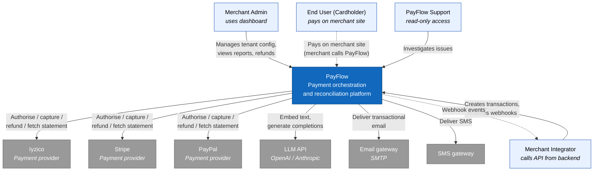

# C4 — System Context Diagram (Level 1)

The Level 1 view shows PayFlow as a single box and the people and systems it talks to. The interesting question at this level is "who depends on PayFlow and what does PayFlow depend on" — not what is inside.

## Actors and external systems

### Merchant Admin

A human user logging into the PayFlow dashboard. Belongs to exactly one tenant. Typical actions: register a payment provider, view reports, issue a refund, configure routing rules.

### Merchant Integrator

A developer at the merchant's company. They never touch the dashboard for routine work; they call `POST /api/transactions` from their backend and consume webhooks. The API surface is their primary interface to PayFlow.

### End User (cardholder)

The shopper paying on the merchant's site. They do not interact with PayFlow directly — the merchant's checkout collects card details via a provider's tokenisation widget (or the merchant's own PCI-scoped vault) and passes us a token. The reason we include them in the context diagram at all is to make clear that the data path crosses three trust boundaries (browser → merchant → PayFlow → provider) and our threat model has to consider all of them.

### PayFlow Support

Internal staff with read-only access scoped per ticket. Their tooling is not separate; they log into the dashboard with elevated permissions and the audit log records every read.

### Payment providers (Iyzico, Stripe, PayPal)

External systems that actually move money. In this reference implementation they are mocked, but the contracts are modelled after the real APIs. PayFlow communicates with them through one provider adapter each. They communicate back to PayFlow through:

- synchronous HTTPS responses for authorise / capture / refund calls,
- daily settlement statement files,
- (in real life, also asynchronous webhooks for 3DS callbacks and disputes — out of scope here).

### LLM API (OpenAI / Anthropic)

The AI assistant service calls either OpenAI or Anthropic depending on configuration. Embeddings are produced by OpenAI's `text-embedding-3-small` and completions by whichever provider is selected.

### Email gateway (SMTP) and SMS gateway

Outbound transactional channels. Both are mocked in dev. The notification service is the only consumer.

## Trust boundaries

Three are worth naming at this level:

1. **Internet ↔ PayFlow.** All inbound traffic terminates at the gateway. JWT validation and rate limiting happen here.
2. **PayFlow ↔ payment providers.** Each adapter holds tenant-specific credentials. The threat model treats the providers as trusted-but-fallible.
3. **PayFlow ↔ LLM provider.** Treated as a third party with no access to PII. The prompt-building layer strips identifiers before sending; tenant data that reaches the LLM is aggregated, never row-level personal data.

## What this diagram does not show

- Internal services (gateway, identity, payment, transaction, reconciliation, notification, reporting, webhooks, AI assistant) — those are Level 2 in [c4-container.md](c4-container.md).
- Observability sinks (OTel Collector, Jaeger, Prometheus, Grafana, Seq) — those are infrastructure, not actors.
- The merchant's own infrastructure beyond "their backend calls our API" — we treat it as a black box.
