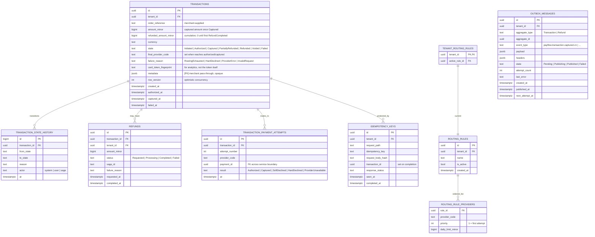

# ERD — Transaction Service

The central context. Owns the Transaction aggregate, the outbox, routing rules, and refund records. Idempotency-key bookkeeping lives in Redis (the request middleware does the work) and is mirrored here only for audit.

## Notes

- **The aggregate boundary.** `transactions` and `refunds` are separate aggregates that reference each other; refunds are not modelled as a collection on the transaction row. This makes refund processing independent of transaction loads — important because refund sagas can run long after the original transaction is otherwise dormant.
- **`refunded_amount_minor` is denormalised.** It tracks the cumulative refunded amount on the parent transaction so the state machine's `Captured → PartiallyRefunded → Refunded` decision is a single-row read. The authoritative ledger of refunds is the `refunds` table; the column is updated by the same handler that consumes `payflow.refund.completed.v1` (see [state-machines/transaction.md](../state-machines/transaction.md)). A reconciliation invariant asserts `refunded_amount_minor = sum(refunds where status = Completed)` per transaction.
- **`row_version`** powers optimistic concurrency for the aggregate. Two consumers reacting to refund events at the same time produce one winner and one retry, never a lost update.
- **`transaction_payment_attempts`** is the routing chain. A transaction that succeeded on the first try has one row; one that failed over has multiple. The `payment_id` references a Payment in the Payment service.
- **`idempotency_keys`** is the audit mirror of the Redis store. The active TTL lives in Redis; this table receives the entry on completion for compliance/forensics. Cleanup runs after 90 days.
- **`outbox_messages`** is the heart of [ADR-0004](../adr/0004-outbox-pattern.md). The publisher behaviour and the row lifecycle are in [docs/database/outbox.md](outbox.md).

## Indexes

| Table | Index | Reason |
|---|---|---|
| `transactions` | unique on `(tenant_id, order_reference)` | merchant-level uniqueness |
| `transactions` | btree on `(tenant_id, created_at desc)` | dashboard listing |
| `transactions` | btree on `(tenant_id, state)` | filtered listing |
| `transaction_state_history` | btree on `(transaction_id, at)` | timeline view |
| `refunds` | btree on `(transaction_id)` | per-transaction listing |
| `idempotency_keys` | unique on `(tenant_id, request_path, idempotency_key)` | the dedup index |
| `outbox_messages` | partial btree on `(state, next_attempt_at)` where `state in ('Pending','Failed')` | the publisher's hot query |
| `outbox_messages` | btree on `published_at` | retention cleanup |

## PII flags

Fields annotated `[PII]` in the schema above are treated as opaque personal data: not indexed, not searched, only stored and echoed back to the merchant in their own response/webhook envelope.

The current PII surface in this context is small:

| Field | Why it's PII |
|---|---|
| `transactions.metadata` | Merchant pass-through. May contain customer identifiers in practice; we do not parse it. |

Retention follows the host transaction: PII fields are purged or tombstoned when the transaction row is purged. A dedicated retention policy doc is intentionally out of scope for the reference implementation — a production deployment would add one (defining retention windows, KVKK/GDPR-aligned tombstones, and the right-to-erasure path).
