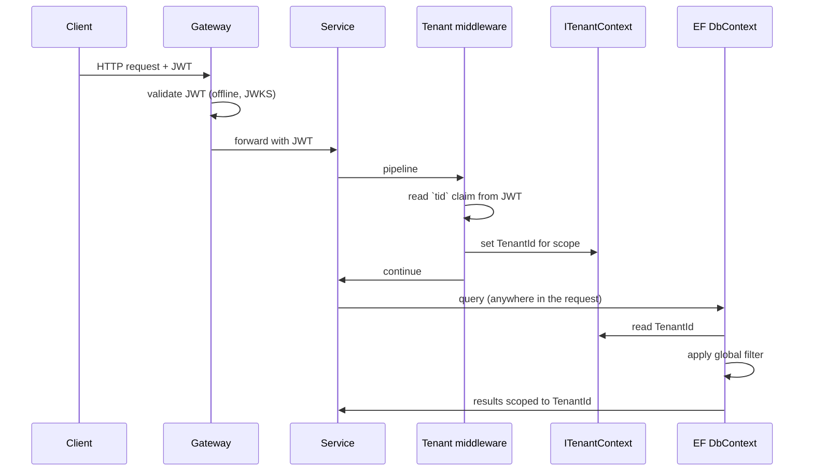

# Multi-Tenancy Data Isolation

The data isolation strategy in one sentence: every tenant-scoped row carries a `TenantId`, EF Core applies a global filter that scopes every query to the current request's tenant, and the test suite fails any new entity that forgets to participate.

This doc covers the runtime mechanics of the multi-tenancy isolation strategy and the parts most likely to leak if anyone is careless.

## Why discriminator column, not schema-per-tenant or DB-per-tenant

The three candidate strategies and why this codebase uses the first:

| Strategy | What | When it pays for itself |
|---|---|---|
| **Discriminator column** (PayFlow) | One set of tables; every row has a `TenantId`; every query is filtered. | Hundreds to low-thousands of tenants with similar workloads, small per-tenant data volumes, frequent code changes. Schema migrations apply once across all tenants. |
| **Schema per tenant** | One schema per tenant inside one database; no `TenantId` columns; the connection chooses the schema. | Tens of tenants with regulatory or performance isolation needs. Each tenant can have slightly different schema versions during a rollout, at the cost of running migrations N times. |
| **Database (or instance) per tenant** | Full physical isolation. | Single-digit tenants, each with hard data-residency or compliance requirements, or with workloads so different they'd contend on shared infrastructure. |

We assume the SaaS shape: many tenants, similar workloads, a single product team. The discriminator approach matches that shape and keeps operational cost roughly constant as tenants are added (provisioning is a row insert, not a database create). Schema-per-tenant turns every migration into an N-way fan-out; DB-per-tenant turns every release into an infrastructure event.

The cost we accept: the isolation is *logical*, enforced in application code. A bug that bypasses the global filter is a cross-tenant leak — that risk is what every other section of this doc is about. The defences are stacked: constructor enforcement, the `SaveChanges` interceptor, two reflection-based tests, and Postgres RLS on the roadmap as a defence-in-depth backstop.

This decision interacts with [ADR-0002](../adr/0002-database-per-service.md): databases are split *per service*, not per tenant. Two orthogonal axes, two different reasons, neither one substitutes for the other.

## How the tenant is resolved



The resolution rules:

1. Every protected endpoint requires a JWT with a `tid` claim. The gateway rejects requests without one before they ever reach a service.
2. The tenant middleware runs as the first thing inside the request pipeline after authentication. It reads `tid` and writes it into a scoped `ITenantContext`.
3. There is no other source. Query strings, headers, body fields claiming "for tenant X" are never honoured. A bug that lets a request body specify the tenant is a P0 incident, not a misconfiguration.
4. Background workers (Kafka consumers, the refund saga recovery sweeper, the notification retry consumer, the webhook retry sweeper) construct their own `ITenantContext` from the event payload's or audit row's `TenantId`, since they do not have a JWT. The mechanism is the same: the value is set once, before any DB call, and read by the global filter.

## How the filter is applied

Every entity that is tenant-scoped inherits from `MultiTenantEntity`:

```csharp
public abstract class MultiTenantEntity : BaseEntity
{
    public Guid TenantId { get; private set; }

    protected MultiTenantEntity(Guid tenantId)
    {
        TenantId = tenantId;
    }
}
```

Each service's `DbContext` registers the global filter in `OnModelCreating`:

```csharp
foreach (var entityType in modelBuilder.Model.GetEntityTypes()
    .Where(t => typeof(MultiTenantEntity).IsAssignableFrom(t.ClrType)))
{
    var method = typeof(DbContextExtensions)
        .GetMethod(nameof(DbContextExtensions.ApplyTenantFilter))!
        .MakeGenericMethod(entityType.ClrType);
    method.Invoke(null, new object[] { modelBuilder, _tenantContext });
}
```

The result: every query against an entity inheriting `MultiTenantEntity` has an implicit `WHERE TenantId = @currentTenant` appended.

## How writes are protected

Reads are filtered automatically. Writes are not — EF will happily save a row with whatever `TenantId` the constructor was given. Two layers protect this:

1. **Constructor enforcement.** `MultiTenantEntity` requires `tenantId` in its constructor. There is no parameterless constructor on entities (we configure EF to use the constructor via `HasConstructorBinding`). A code path that creates an entity must provide a `TenantId`, and the convention is "take it from `ITenantContext`".
2. **`SaveChangesAsync` interceptor.** A `MultiTenantSaveChangesInterceptor` (in `PayFlow.Multitenancy`) iterates over the change tracker before each `SaveChanges` and throws if any added/modified `MultiTenantEntity` has a `TenantId` that does not match the current `ITenantContext`. Catches mistakes where an entity was constructed from a payload's tenant id rather than the request's.

The interceptor's exception is a `TenantMismatchException`, classified by the global exception handler as a 500 (it is a server bug, not a client error).

## How the test suite catches drift

There is a single test that scans the assembly:

```csharp
[Fact]
public void Every_tenant_scoped_entity_must_inherit_from_MultiTenantEntity_and_be_filtered()
{
    var dbContextType = typeof(TransactionDbContext);
    using var ctx = TestFactory.CreateDbContext(...);
    foreach (var et in ctx.Model.GetEntityTypes())
    {
        if (typeof(MultiTenantEntity).IsAssignableFrom(et.ClrType))
        {
            et.GetQueryFilter().Should().NotBeNull(
                $"{et.ClrType.Name} inherits MultiTenantEntity but has no global filter");
        }
    }
}
```

We also have a paired test that asserts the *known* set of entities and fails when a new one is added without explicitly classifying it as either tenant-scoped or global:

```csharp
[Fact]
public void All_entities_must_be_explicitly_classified()
{
    var classified = TenantClassification.KnownEntities;   // hand-maintained list
    var actual = ctx.Model.GetEntityTypes().Select(t => t.ClrType.Name).ToHashSet();
    actual.Should().BeEquivalentTo(classified.Keys,
        "any new entity must be added to TenantClassification with its scope");
}
```

The second test is the one that catches the most common mistake: adding a new entity, forgetting that it needs tenant scoping, and shipping. The compile passes, the integration tests pass, this one fails.

## Things that bypass the filter (deliberately)

A small list of explicit escape hatches:

| Where | What | Why |
|---|---|---|
| Identity's tenant-management endpoints | Read across all tenants | The admin UI for listing tenants needs this; gated by a `system.tenant.read` permission that no tenant role has. |
| Reconciliation's job dispatcher | Iterate tenants to schedule per-tenant runs | The job itself sets the tenant context before each tenant's work. The dispatcher uses `IgnoreQueryFilters()` on a specific narrow query. |
| Reporting's daily backfill jobs | Cross-tenant aggregation for ops dashboards | Same pattern, gated by elevated permission, never exposed to a tenant request. |

Each escape hatch is a method-level call to `.IgnoreQueryFilters()` and is reviewed line-by-line on the PR that introduces it. There are currently three. Adding a fourth requires a security review.

## What can still go wrong

The two failure modes left, both treated in the [threat model](../security/threat-model.md):

1. **A raw SQL query that bypasses EF.** `FromSql` and `ExecuteSqlRaw` do not go through the filter. We forbid them in business paths. The lint check in CI flags any `ExecuteSqlRaw` call outside the `Reporting.Infrastructure.Projections` namespace.
2. **A background worker that processes an event without setting the tenant context.** Reviewed in the worker base class; the abstract `EventHandlerBase<T>` requires the event to expose `TenantId` and sets the context from it. Direct event handlers (not inheriting the base) are not allowed.

Defence in depth is on the roadmap (Postgres RLS as a backstop). It is not load-bearing today.
