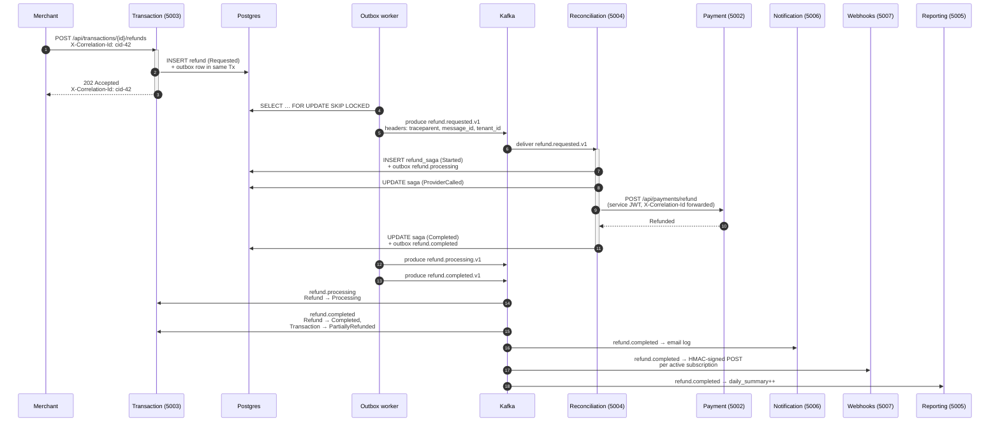

# End-to-end trace — refund example

Single Jaeger trace from a refund request all the way through the saga,
the Payment HTTP round-trip, and the consumers on the other side of
Kafka. Kafka headers carry W3C traceparent so the broker isn't a trace
boundary — every span lives under one `traceID`.



## What this trace shows

- A single `traceID` covers every box in the diagram. The user can search
  Jaeger for the correlation id from the response header and see the
  whole picture, including the Kafka hops.
- Each `kafka.publish` span has a matching `kafka.consume` span under the
  same parent. The Confluent Kafka client itself isn't instrumented; the
  spans are added in `KafkaOutboxPublisher.PublishAsync` and
  `KafkaConsumerBackgroundService.DispatchAsync` (see
  `src/BuildingBlocks/PayFlow.EventBus.Kafka/Telemetry/KafkaTelemetry.cs`).
- The HTTP hop from Reconciliation to Payment is auto-instrumented by
  the AspNetCore + HttpClient OpenTelemetry packages. The forwarded
  service JWT (signed by Reconciliation, accepted by Payment) carries
  the saga's tenant id in the `tid` claim — Payment's multitenancy
  middleware uses it for scope, never the request body.
- Logs are correlated by `CorrelationId`: it comes off the inbound
  `X-Correlation-Id` header or the current Activity id, and Serilog
  pushes it into the `LogContext` for the request scope so every line
  the request produces carries it. The same value comes back to the
  client in the response header.

## Probing the live stack

```sh
# Trigger the flow
curl -X POST http://localhost:5003/api/transactions/$TXID/refunds \
  -H "Authorization: Bearer $TOKEN" \
  -H "X-Correlation-Id: cid-42" \
  -H "Idempotency-Key: $(uuidgen)" \
  -H "content-type: application/json" \
  -d '{"amountMinor":3000}'

# Pull the trace
open "http://localhost:16686/search?service=payflow-transaction&lookback=5m"
```

Search `service=payflow-transaction` and pick the trace that lists
`payflow-payment`, `payflow-reconciliation`, `payflow-reporting`,
`payflow-notification`, and `payflow-webhooks` in its process list.
That's the one.
