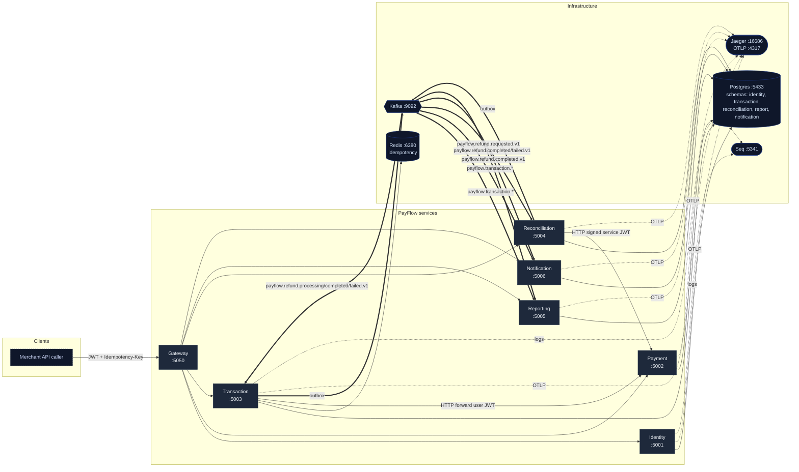

# Runtime topology

Snapshot of what is actually running once the local stack is up. Each box
is a process; each arrow is real wire traffic.

## Reading guide

- **Solid arrows** = synchronous HTTP. The user's JWT flows through the gateway and is either forwarded (TX → Payment) or replaced by a short-lived service JWT (Reconciliation → Payment, where there is no end-user).
- **Double arrows** (`==>`) = outbox → Kafka path. Transaction and Reconciliation emit; everyone else only consumes. The outbox publisher claims rows with `SELECT … FOR UPDATE SKIP LOCKED` so multiple instances are safe.
- **Single equals**-style topic arrows show the producer → consumer routing of each topic. A single Kafka message can fan out to two or three consumers (e.g. `payflow.refund.completed.v1` reaches Transaction *and* Reporting *and* Notification).
- **Dotted arrows** are telemetry: OTLP to Jaeger for traces, Seq for structured logs. Both run in the docker compose stack.

## Service summary

| Service        | Owns                                | Reads from Kafka (topics)                                                                 |
|----------------|-------------------------------------|-------------------------------------------------------------------------------------------|
| Gateway        | routing, auth boundary              | —                                                                                          |
| Identity       | tenants, users, JWT issuance        | —                                                                                          |
| Payment        | provider adapters, charge/refund    | —                                                                                          |
| Transaction    | tx aggregate, refund aggregate      | `refund.processing/completed/failed`                                                       |
| Reconciliation | refund saga                         | `refund.requested`                                                                         |
| Reporting      | daily summary projection            | `transaction.initiated/captured/failed`, `refund.completed`                                |
| Notification   | per-event email log                 | `transaction.captured`, `refund.completed`, `refund.failed`                                |
