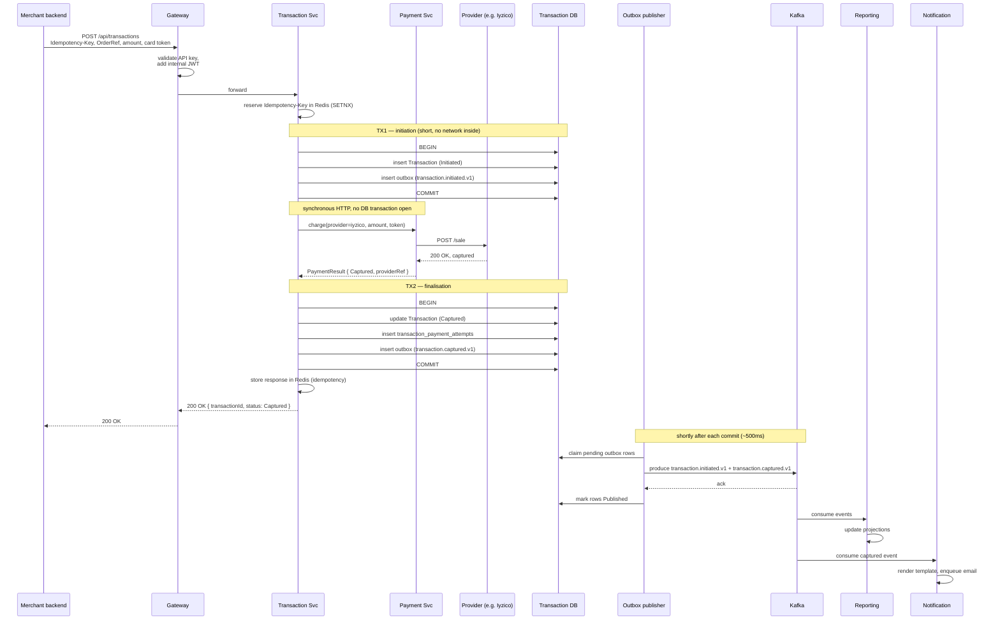

# Flow — Payment Happy Path

The canonical case. Merchant calls `POST /api/transactions`, one provider authorises and captures, downstream consumers do their work, the merchant gets a confirmation. No retries, no failover.

## Step-by-step

1. **Merchant submits.** Their backend (never their browser — API keys are server-side credentials) sends a POST with the API key, an `Idempotency-Key`, an `OrderReference`, the amount in minor units, the currency, and a card token they obtained from the provider's tokenisation widget.
2. **Gateway authenticates.** The API key is verified against Redis cache (refilled from Identity). A short-lived internal JWT is minted carrying `tid`, `sub=apikey:<id>`, and the role array. The request is forwarded to Transaction.
3. **Idempotency reservation.** The middleware does an atomic `SETNX` on `(TenantId, request_path, Idempotency-Key)` in Redis. Missing → proceed (the key now reserves the slot). Present and complete → return stored response. Present and in-flight → 409. If Redis itself is unavailable, the request fails closed with 503; see [docs/api/idempotency.md](../api/idempotency.md).
4. **Begin TX1 — initiation.** Transaction opens its first DB transaction. It inserts the `Transaction` row in `Initiated`, a `transaction_state_history` row for the initial state, and one outbox row for `transaction.initiated.v1`. It commits immediately. *No network call happens with this transaction open*; the connection is released back to the pool the moment the commit returns.
5. **Pick provider.** Outside any DB transaction, Transaction uses the merchant's configured routing rule to pick the first provider (in this happy path, Iyzico).
6. **Call Payment.** Synchronous HTTP. Payment translates the request into Iyzico's wire format via the Iyzico adapter and calls the mock provider's `/sale` endpoint. Payment runs in its own DB transaction inside Payment's schema (writes a `payments` row and, on completion, its own outbox row for `payment.completed.v1`). Payment's DB transaction does not span the provider call either — see [docs/database/outbox.md](../database/outbox.md).
7. **Provider returns success.** Iyzico (mock) responds with `200 OK` and a captured payment. Payment normalises to `PaymentResult { status: Captured, providerReference, latency }`.
8. **Begin TX2 — finalisation.** Back in Transaction, with the provider answer in hand, the aggregate is re-loaded (optimistic concurrency via `row_version`), moves from `Initiated` to `Captured`, writes a `transaction_state_history` row, writes the `transaction_payment_attempts` row pointing to Payment's `payment_id`, and writes one outbox row for `transaction.captured.v1`. One commit covers all four writes.
9. **Idempotency record.** The serialised response is written to the Redis key reserved in step 3, the slot is flipped from "reserved" to "complete", and the 24-hour TTL is set.
10. **Return to merchant.** 200 OK with `{ transactionId, status: "Captured", providerReference }` and the headers `Idempotency-Key` and `traceparent`.
11. **Outbox publishers pick up.** Within the configured poll window (default 500ms), each producing service's publisher claims pending rows in its own outbox, produces to Kafka, receives the ack, and marks the rows `Published`. `transaction.initiated.v1`, `payment.completed.v1`, and `transaction.captured.v1` are published from three different outbox writers and arrive on three different topics.
12. **Downstream reacts.** Reporting projects the events into `daily_volume_by_provider` and similar projections. Notification renders a confirmation template from `transaction.captured.v1` and pushes the resulting email job. Reconciliation indexes the transaction for next morning's matching.

## Why the request flow uses two DB transactions, not one

Holding a DB transaction open during a synchronous HTTP call to Payment would mean a Postgres connection is occupied for the ~130ms provider round-trip (and any tail latency on top of that). Under load, that exhausts the connection pool well before request throughput becomes the bottleneck, and it converts every provider hiccup into a database back-pressure event. The two-transaction shape pays a few extra writes (one extra outbox row for `transaction.initiated.v1`, one extra commit) and gets cleaner pool behaviour in exchange.

The cost of the extra `transaction.initiated.v1` is small — and it has independent value: Reporting already wants `initiated` for attempted-volume accounting, and the event existed in [docs/events/catalog.md](../events/catalog.md) before the flow was tightened.

## Latency budget

Realistic targets at p95 against a mock provider with 100ms simulated latency:

| Hop | Budget | Notes |
|---|---|---|
| Gateway auth + forward | 20ms | Redis hit + JWT mint |
| Idempotency reservation | 5ms | Redis `SETNX` |
| TX1 begin → commit | 15ms | local Postgres, one row + state-history + outbox |
| Payment call (sync) | 130ms | dominated by the mock's 100ms; no DB transaction open |
| TX2 begin → commit | 20ms | update + attempts + outbox |
| Total request → response | 200ms | |
| Outbox → Kafka ack | +500ms (asynchronous, not in the response budget) | |
| Reporting projection lag | +1-2s p95 | |

Anything above 500ms end-to-end with a live provider is dominated by provider latency, not us. The internal slice should stay under 100ms in steady state.

## What is *not* shown

- 3DS challenges. The merchant's checkout would handle the cardholder challenge before getting the token; by the time we see the request, the token already represents a 3DS-cleared card. Adding the full 3DS dance is a stretch goal.
- Webhook delivery to the merchant. Happy-path captures do trigger a webhook (the merchant subscribed to `transaction.captured`); the delivery contract is in [docs/api/webhooks.md](../api/webhooks.md).
- Auth-only flows. If the merchant configured "authorise on order, capture on ship", the response status is `Authorized` and a subsequent capture call moves the state forward. The lifecycle is the same shape, just two requests.

## What a reader might worry about

- *"What if Payment succeeds but TX2 never commits?"* The `payments` row in Payment's schema exists, Payment's outbox emits `payment.completed.v1`, but Transaction's row stays in `Initiated`. A scheduled job in Reconciliation looks for `Initiated` transactions older than a threshold (default 5 minutes) with at least one `payment.completed.v1` for that `transaction_id` in the Reporting projection, and either drives them to a terminal state or surfaces them as a `MissingFinalisation` mismatch. We accept this rare outcome over the alternative of distributed transactions.
- *"What about the dangling `Initiated` aggregate during normal failure?"* If Payment fails terminally, TX2 still runs — it transitions to `Failed` and writes `transaction.failed.v1`. `Initiated` is only an orphan when the service itself crashed between TX1 and TX2, which is exactly what the Reconciliation sweep above covers.
- *"What if the outbox publisher never gets to the row?"* Then `outbox_pending_count` rises and the alert fires. The row is still there; the event will eventually be published. Consumers dedupe by `message_id`.
- *"What if the idempotency store is unavailable mid-flight?"* See [docs/api/idempotency.md](../api/idempotency.md) — we fail closed with 503, the request never reaches TX1.
- *"What if a downstream consumer is slow and lags far behind?"* Kafka stores the messages with a 30-day retention; the consumer catches up. The dashboard might be temporarily stale; the source of truth is fine.
