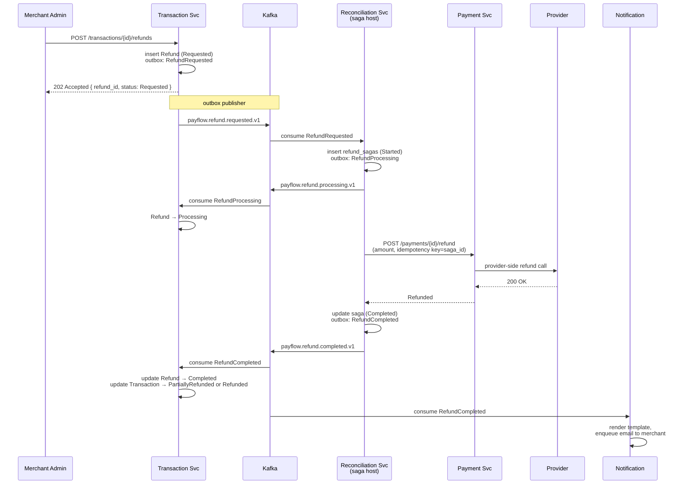
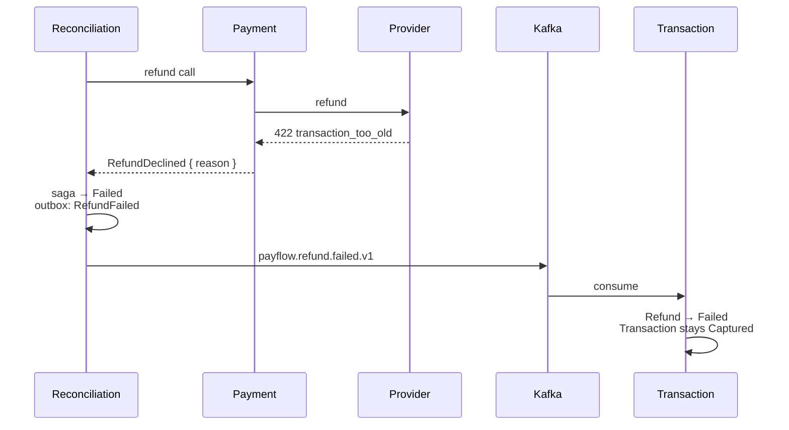

# Flow — Refund Saga

A refund is a multi-step workflow that touches Transaction, Reconciliation, Payment, and Notification. It runs as a choreography (no orchestrator), driven by integration events. The Reconciliation service hosts the saga state because that's where long-running provider interactions already live.

## Why a saga, not a sync chain

A refund could be implemented as a synchronous HTTP chain (`POST /refunds` → call Payment inline → return). Three reasons against:

1. **Provider latency is unpredictable.** Some refunds take seconds; some take a long time (especially the first refund of the day against an idle provider). A synchronous endpoint that holds the connection open is bad UX and worse capacity planning.
2. **Retry semantics.** A provider refund call may need to be retried minutes later. That cannot happen inside an HTTP request — it has to happen in a worker context.
3. **Multiple consumers care.** Notification, Reporting, and the Transaction aggregate all need to react to `RefundCompleted`. A synchronous chain would either force Transaction to fan out itself (coupling) or leave Notification and Reporting to chase the change with polling.

## Step-by-step

1. **Merchant requests refund.** The Transaction service validates (amount ≤ remaining capturable, transaction in `Captured` or `PartiallyRefunded`), creates a `refunds` row in `Requested`, and writes an outbox row for `RefundRequested`. The response is 202 Accepted with the new `refund_id` — the merchant is told the request is queued, not that it succeeded.
2. **Outbox publishes.** Standard outbox path. Payload includes `refund_id`, `transaction_id`, `tenant_id`, `amount_minor`, the original `final_provider_code` from the transaction.
3. **Reconciliation accepts the saga.** The refund-saga consumer in Reconciliation starts a `refund_sagas` row in state `Started` and writes an outbox row for `RefundProcessing`. Both writes are one DB transaction.
4. **`RefundProcessing` fans out.** Transaction consumes it and flips its local `refunds` row from `Requested` to `Processing`. Reporting consumes it too (it tracks saga latency). The merchant's dashboard shows `Processing` within seconds of the original request, and there is no synchronous cross-service call to make that happen.
5. **Reconciliation calls Payment.** Payment routes to the original provider's adapter, passes the saga id as the idempotency key. The adapter calls the provider's refund endpoint.
6. **Provider responds.** On success, Payment writes its own `payments` row (operation = Refund) and returns to Reconciliation.
7. **Reconciliation publishes RefundCompleted.** Saga state moves to `Completed`. Outbox row written, published.
8. **Transaction consumes RefundCompleted.** Updates the `refunds` row to `Completed`, updates the parent transaction's state machine (`Captured` → `PartiallyRefunded` or `Refunded`), updates `refunded_amount_minor`. No further events from Transaction.
9. **Notification consumes RefundCompleted.** Renders the merchant's "refund confirmed" template and sends.

## Failure paths

### Provider returns terminal failure

`RefundFailed` is published with the provider-normalised reason. Notification sends a separate "refund could not be processed" template. The merchant can attempt another refund (different amount, different time) — that creates a new Refund record, not a retry of the old one.

### Provider returns transient failure

Payment's adapter classifies the response. Transient (5xx, timeout, rate limit) bubbles up as `ProviderUnavailable`. Reconciliation's saga catches it, stays in `Processing`, and schedules a retry via Hangfire with the backoff:

| Attempt | Delay |
|---|---|
| 1 → 2 | 1 minute |
| 2 → 3 | 5 minutes |
| 3 → 4 | 30 minutes |
| 4 → 5 | 2 hours |
| 5 → 6 | 6 hours |
| 6+ | terminal — saga → Failed |

The retry budget for refunds is more generous than for outbox publishing because the "right" outcome of the refund is much more important than the latency of getting there.

### Crash between consume and publish

Reconciliation's saga step is idempotent: if the saga is already in `ProviderCalled`, a re-delivered `RefundRequested` no-ops. If the saga reaches `Completed` but the outbox publisher dies before the `RefundCompleted` is on Kafka, the next outbox tick recovers it (the outbox guarantee from [ADR-0004](../adr/0004-outbox-pattern.md)).

## Why no compensation step in the happy path

Choreography sagas usually involve "do step A, then B; if B fails, undo A". Refunds in PayFlow do not have that shape because:

- The provider call is the *terminal* step that costs real money. There is nothing after it to undo on the provider side.
- Updating Transaction's state machine after `RefundCompleted` is a local DB write that cannot fail in a way that requires undoing the provider refund. Worst case: the consumer is stuck, the operator manually re-applies the event.

The `Compensating` state in the saga state machine is there for the (rare) future case where a downstream consumer's failure requires us to cancel a refund we already authorised with the provider. We do not currently exercise it.

## What the merchant sees

Through the dashboard or the API:

1. Immediately: refund record in `Requested`.
2. Within seconds: state changes to `Processing`.
3. Within seconds to minutes: terminal state (`Completed` or `Failed`).

If the merchant polls the API instead of waiting for the webhook, they see the same progression. The webhook contract is in [docs/api/webhooks.md](../api/webhooks.md).
