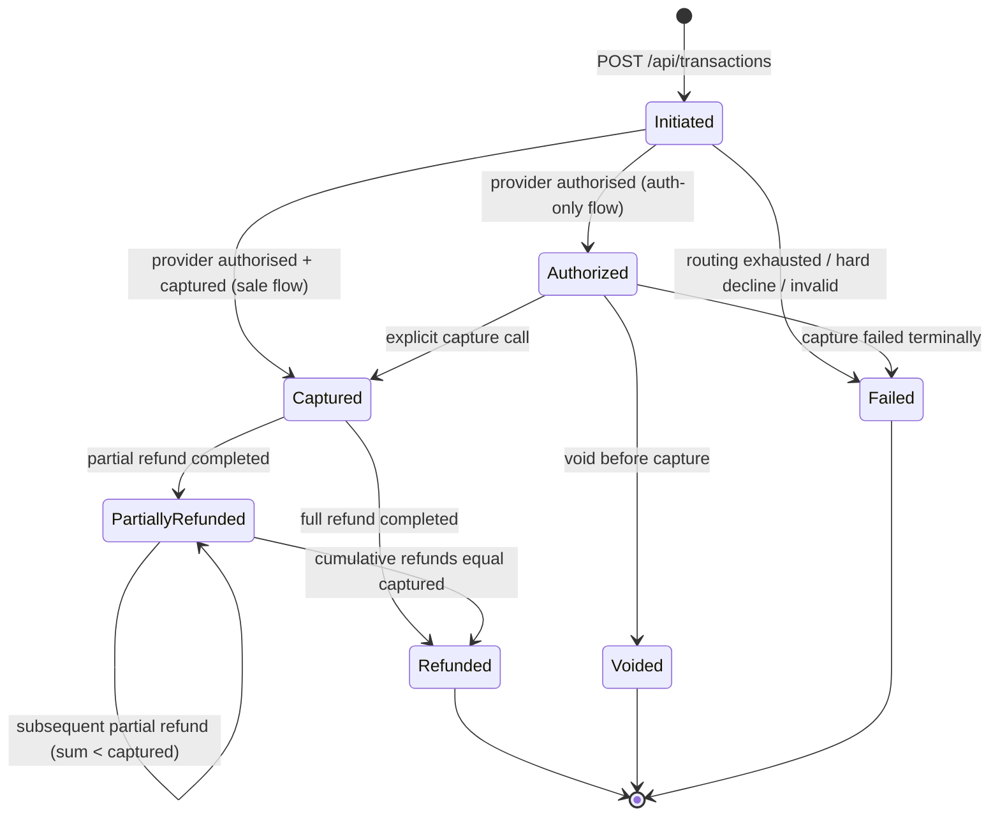

# State Machine — Transaction

The Transaction aggregate's lifecycle. State transitions are enforced inside the aggregate (state changes go through methods that validate the source state); the database stores the resulting state and a row in `transaction_state_history` per transition.



## States

| State | Meaning | Terminal? |
|---|---|---|
| `Initiated` | Aggregate created, no provider has been asked yet. Lives for milliseconds in the happy path. | No |
| `Authorized` | One provider has authorised. Funds are on hold but not captured. | No |
| `Captured` | One provider has captured. Funds have moved (or will at settlement). | No (refunds may follow) |
| `Voided` | Authorisation cancelled before capture. | Yes |
| `PartiallyRefunded` | At least one refund has completed; the running total is less than captured amount. | No |
| `Refunded` | Full amount refunded. | Yes |
| `Failed` | Either routing exhausted, a hard decline arrived, or the request was rejected. | Yes |

## Transition rules

| From | Event | To | Notes |
|---|---|---|---|
| `Initiated` | Provider returns `Authorized` (auth-only) | `Authorized` | Single allowed transition for auth-only flow. |
| `Initiated` | Provider returns `Captured` (sale) | `Captured` | Single transition for sale flow. |
| `Initiated` | All providers exhausted with soft declines | `Failed` | Reason: `RoutingExhausted`. |
| `Initiated` | Any provider returns hard decline | `Failed` | Reason: `HardDeclined`. No more attempts. |
| `Authorized` | Capture request from merchant | `Captured` | Uses the same provider that authorised. |
| `Authorized` | Void request from merchant | `Voided` | Calls the original provider's void endpoint. |
| `Authorized` | Capture timeout exceeded (default 7 days) | `Voided` | Optional, opt-in per tenant policy. |
| `Captured` | `RefundCompleted` event with amount < captured | `PartiallyRefunded` | Updates `refunded_amount_minor`. |
| `Captured` | `RefundCompleted` event with amount == remaining | `Refunded` | |
| `PartiallyRefunded` | `RefundCompleted` event, sum still less than captured | `PartiallyRefunded` | Self-loop. |
| `PartiallyRefunded` | `RefundCompleted` event, sum equals captured | `Refunded` | |

## What is *not* a transition

A few non-transitions that look like they should be:

- **Failed → anything.** A failed transaction is dead. A retry from the merchant is a new transaction (with a new `Idempotency-Key`).
- **Voided → anything.** Same.
- **Captured → Voided.** Once captured, the only way to reverse is a refund. Some providers conflate "void" and "refund within the same day"; we still model it as a refund, just one that the provider can fast-path.
- **Refunded → anything.** Terminal.

## Concurrency

The aggregate uses optimistic concurrency via a `row_version` column (Postgres `xmin` or an explicit `int` updated on every save). A concurrent update — e.g. two refund consumers each acting on a different `RefundCompleted` event — produces a concurrency exception, and the loser retries by re-loading and re-applying its event. The idempotency layer ensures the retry does not double-apply.

## Event publication

Each transition publishes exactly one event from the outbox:

- `Initiated` → `payflow.transaction.initiated.v1`
- `Authorized` → `payflow.transaction.authorized.v1`
- `Captured` → `payflow.transaction.captured.v1`
- `Voided` → `payflow.transaction.voided.v1`
- `PartiallyRefunded` / `Refunded` → these are reactions to `payflow.refund.completed.v1` from Reconciliation. The Transaction service updates its state but does not re-publish; the refund event is itself the broadcast.
- `Failed` → `payflow.transaction.failed.v1`

This asymmetry — most transitions publish, refund transitions consume — is the choreography model in action. There is no orchestrator that owns the refund saga; each service writes its own response into the event stream.

## Why a state machine and not just a status field

Two reasons. First, illegal transitions are caught at the aggregate, not at the database. A `transaction.MoveToVoided()` call on a `Captured` aggregate throws before any SQL runs. Second, the history is preserved row-by-row, which makes audit and incident reconstruction tractable. The dashboard's transaction timeline is `transaction_state_history` rendered as a list.

The aggregate code is short on purpose — most of the value is in keeping it readable:

```csharp
public void MoveToAuthorized(string providerCode, string providerReference, int attemptNumber)
{
    EnsureState(TransactionState.Initiated);
    State = TransactionState.Authorized;
    FinalProviderCode = providerCode;
    AuthorizedAt = _clock.UtcNow;
    Raise(new TransactionAuthorizedDomainEvent(...));
}
```

`EnsureState` is one line that throws `InvalidStateTransitionException` if the current state doesn't match the expected set. Every method on the aggregate calls it.
